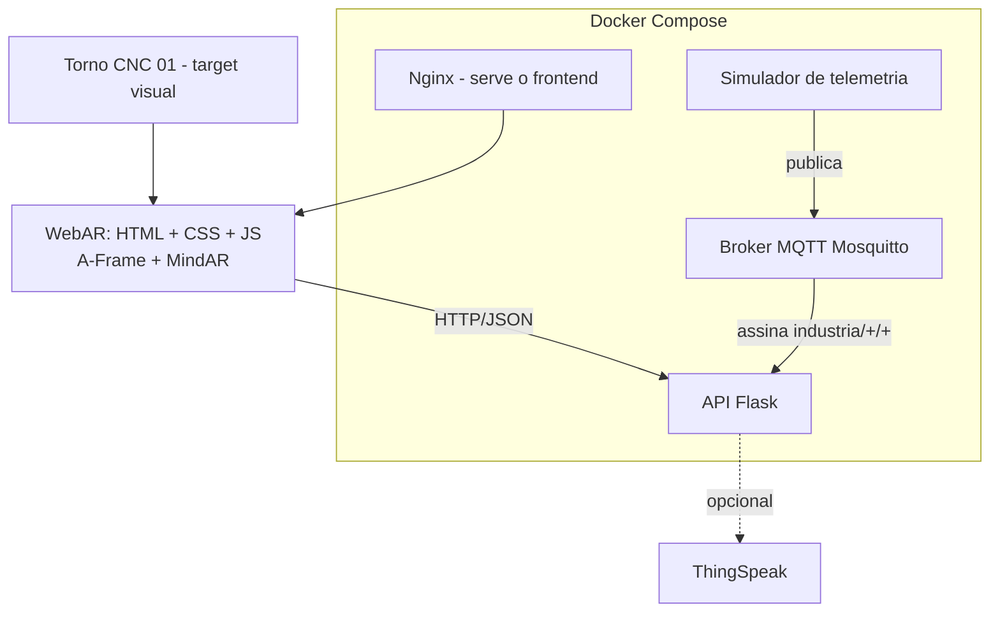

# Arquitetura

| Serviço | Container | Porta | Função |
|---|---|---|---|
| mqtt | eclipse-mosquitto:2 | 1883 | Broker: recebe e distribui mensagens por tópico |
| api | build ./backend | 5000 | Assina o MQTT, guarda o último valor em memória, responde HTTP/JSON |
| simulator | build ./simulator | - | Publica telemetria fictícia a cada 3 s |
| frontend | nginx:alpine | 8080 | Serve os arquivos estáticos da WebAR |

Tópicos: `industria/CNC-01/temperatura`, `industria/CNC-01/vibracao`, `industria/CNC-01/status`.

Para o diagrama em imagem (`arquitetura.png`, pedido nos entregáveis), cole o bloco mermaid em https://mermaid.live e exporte em PNG.

## Decisões: interface x serviço
1. **Descrição e função dos componentes ficam no frontend**: mudam raramente e precisam aparecer mesmo sem rede.
2. **Status, temperatura, vibração e última atualização vêm da API**: mudam o tempo todo e não podem ficar fixos no app.js; centralizar na API evita que cada celular tenha um valor diferente.
3. **O navegador não fala MQTT**: o HTTP/JSON é mais simples de proteger e de tratar falhas, e a API isola o frontend do broker.
